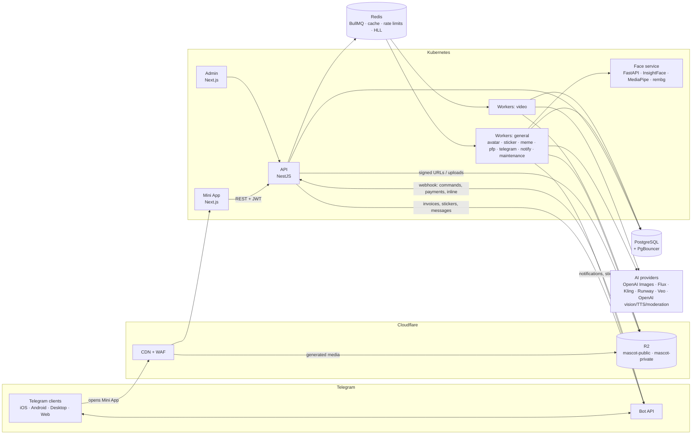
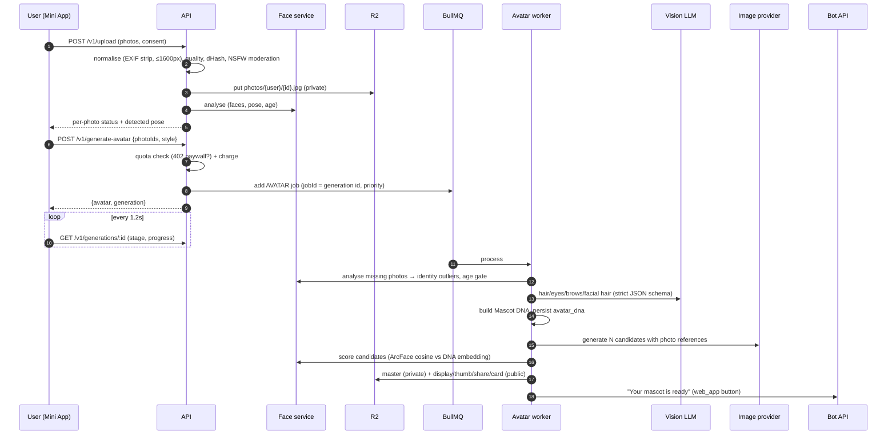

# 1. Architecture

Mascot AI turns 5–20 selfies into a personal, stylised 3D mascot that stays recognisable across every
piece of content generated from it (styles, stickers, memes, profile pictures, videos). It ships as a
Telegram Mini App, a Telegram bot, an asynchronous AI pipeline and an internal admin dashboard.

## Design principles

| Principle | What it means in the code |
|---|---|
| **Extract identity once, reuse forever** | Face analysis + vision attributes produce **Mascot DNA** (closed vocabulary + proportions + ArcFace embedding) stored in `avatar_dna`. Every later generation compiles prompts from DNA and anchors on the master render, so the character stays consistent and we never re-run face analysis. |
| **Queue-first** | The HTTP API never calls an AI provider. It validates, charges, persists a `generation` row and enqueues a BullMQ job (`jobId = generation.id`). Workers do the slow work and stream progress back through the row. |
| **Every AI vendor behind an interface** | `ImageProvider` (OpenAI / Flux / mock), `VideoProvider` (Kling / Runway / Veo / mock), `FaceAnalyzer`, `VisionExtractor`, `TtsProvider`. Selected by env; swapping vendors is a config change. |
| **Charge before work, refund on failure — exactly once** | `QuotaService` returns a `Charge` stored in `generation.input.charge`; `GenerationsService.fail()` refunds it under a status guard so retries never double-refund. |
| **Idempotent everywhere** | `Idempotency-Key` header on generation endpoints, jobId = generation id, Telegram `update_id` de-dupe, `telegram_payment_charge_id` unique constraint. |
| **Privacy by design** | Explicit biometric consent before the first upload, private bucket + signed URLs for photos, automatic deletion after 30 days, GDPR erasure endpoint, face service unreachable from outside the cluster. |
| **Runs end-to-end with zero AI keys** | Mock providers (DNA-driven 3D mascots from the in-app three.js renderer via headless Chromium, SVG fallback, ffmpeg "video model", deterministic face analysis) make local dev, CI and the e2e test exercise the real pipeline. |

## System context

## Components

| Component | Tech | Responsibility | Scales on |
|---|---|---|---|
| **Mini App** (`apps/web`) | Next.js 16, React 19, Tailwind v4, Framer Motion, TanStack Query, Zustand | All user flows inside Telegram; public SSR share page `/m/[slug]` with OG previews | CPU (HPA) — mostly static, CDN-cached |
| **API** (`apps/api`, `main.ts`) | NestJS 11, Prisma 6, BullMQ, Sharp | Auth (Telegram initData → JWT), REST, uploads, quotas, payments, bot webhook, admin API | CPU (HPA 3→30) |
| **Workers** (`apps/api`, `worker.ts`) | Same image, `WORKER_QUEUES` selects processors | AI pipelines, Telegram publishing, notifications, maintenance crons | Queue depth (KEDA 3→60, video 2→20) |
| **Face service** (`apps/face-service`) | FastAPI, InsightFace `buffalo_l`, MediaPipe Face Mesh, rembg | Detection, pose, age, ArcFace embeddings, landmark proportions, skin tone, matting | CPU (HPA 2→16), GPU optional |
| **Admin** (`apps/admin`) | Next.js, Recharts | Analytics, users, revenue, generations, abuse, payments, style engine | 1 replica, IP-restricted |
| **PostgreSQL** | Managed PG 16 + PgBouncer (transaction mode) | Source of truth | Vertical + read replica for analytics |
| **Redis** | Managed Redis 7, `noeviction`, AOF | BullMQ, rate limits, daily quotas, DAU HyperLogLogs, caches, ban set | Vertical; separate instance for cache at scale |
| **Cloudflare R2 + CDN** | S3 API | Private photos & HD masters (signed URLs); public renders/stickers/memes/videos behind `cdn.mascot.ai` | Unlimited, zero egress fees |

## Key flows

### Create a mascot

### Stars payment

See [09-payments.md](09-payments.md) for the full sequence (invoice → pre-checkout ≤ 10 s → `successful_payment` → idempotent fulfilment → renewals → refunds).

## Scaling to 100,000 users

### Load model (launch quarter)

| Assumption | Value |
|---|---|
| Registered users | 100,000 |
| DAU / MAU | 15k / 60k |
| Activation (uploaded → first mascot) | 40% → **40k mascots** |
| Free stickers per activated user | 5 → **200k sticker renders** |
| Premium conversion | 4% → **4k subscribers** |
| Premium usage / subscriber / month | 3 style renders, 1 extra mascot, 2 sticker packs, 6 video units |
| Viral peak | 10× average for ~6 h after a creator post → **~5,000 mascot jobs/hour** |

### Capacity

| Tier | Math | Provisioning |
|---|---|---|
| API | ~150 req/s at peak (polling dominates: 1 req/1.2 s per active generation); NestJS handles ~1.5k req/s/core for these handlers | 3 → 12 pods × 0.5–1 vCPU |
| Avatar workers | Avatar job ≈ 45–70 s wall-clock, I/O bound; concurrency 4/pod → ~240 jobs/h/pod | 5k jobs/h peak → **~21 pods** (KEDA max 60) |
| Image provider | 5k avatars/h × 1–2 images + stickers ≈ 150–250 images/min | `IMAGE_PROVIDER_RPM` limiter keeps us inside the vendor tier; jobs wait instead of 429-ing |
| Face service | ~250 ms/image on 2 vCPU; ~10 images per mascot → 14 images/s at peak | 2 → 16 pods (or 2 GPU pods) |
| PostgreSQL | < 400 writes/s at peak (progress updates are the hot path) | 4 vCPU / 16 GB managed instance + PgBouncer; read replica for admin analytics |
| Redis | BullMQ + rate limits + HLLs; < 5k ops/s | 2 GB managed instance |
| Storage | ~6 MB per activated user (photos purged after 30 d) → ~250 GB steady state | R2: ~$4/month storage, egress free |

### Bottlenecks & mitigations

1. **AI provider throughput/cost** — cluster-wide RPM limiter (`ProviderRateLimiter`), priority queue for Premium,
   provider failover by config, medium quality for 512 px outputs, single candidate for FREE.
2. **Polling load** — cheap indexed lookup by primary key; can be swapped for SSE without client changes.
3. **Progress write amplification** — progress updates are stage-granular (≤ 12 writes per job).
4. **Hot rows** — quota decrements are conditional `UPDATE … WHERE credits >= n` (no read-modify-write races).
5. **Telegram limits** — notification queue limited to 25 msg/s; sticker uploads 20 req/s.

### Unit economics (AI cost per action)

| Action | Provider calls | ≈ Cost |
|---|---|---|
| First mascot (FREE) | vision ×1 + gpt-image-1 high ×1 | **$0.17** |
| Mascot (Premium, best-of-2) | vision ×1 + high ×2 | $0.34 |
| Sticker | gpt-image-1 medium ×1 | $0.042 |
| Meme | reuses sticker render when possible, else medium ×1 | $0–0.042 |
| Profile picture (instant / AI) | none / medium ×1 | $0 / $0.042 |
| Video (5 s, Kling std) | Kling ×1 (+ TTS) | ~$0.28 |

FREE user fully activated (mascot + 5 stickers) ≈ **$0.38**; 40k activations ≈ **$15k/month**.
Premium at 450 ⭐ ≈ $5.85 developer payout; 4k subscribers ≈ $23k/month + credit packs. Levers: conversion
(paywall placement on high-intent moments), credit packs for FREE users, referral credits instead of free
renders, cheaper sticker model, caching reaction renders across memes.

## Security model (summary)

- **Authentication**: Telegram initData HMAC (bot-token derived key) verified server-side with a 24 h freshness window; short-lived JWT with audience separation (`app` vs `admin`). Admins authenticate with the Telegram Login Widget and must have `ADMIN`/`SUPPORT` role.
- **Authorization**: every query is scoped by `userId`; admin routes require admin audience + role.
- **Abuse**: Redis rate limits per user/IP, daily fair-use caps, NSFW/text moderation, minor detection, identity-consistency check (prevents generating mascots of other people from scraped photos), risk score with auto-ban.
- **Data**: private bucket for biometric inputs, signed URLs (15 min), automatic purge, GDPR erasure, payments retained anonymised.
- **Secrets**: env-validated at boot; production refuses dev defaults; K8s secrets via External Secrets.
- **Webhook**: `X-Telegram-Bot-Api-Secret-Token` constant-time check, update de-duplication.
