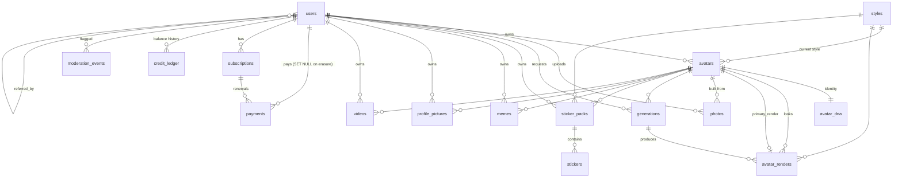

# 3. Database design

PostgreSQL 16 via Prisma 6. Full schema: [`apps/api/prisma/schema.prisma`](../apps/api/prisma/schema.prisma);
initial migration: `apps/api/prisma/migrations/*_init/migration.sql`.

## Entity relationship diagram

## Tables

| Table | Purpose | Notable columns |
|---|---|---|
| **users** | Telegram identity, plan cache, quotas | `telegram_id BIGINT UNIQUE`, `plan` + `premium_until` (denormalised, recomputed from subscriptions), `credits` (running balance), `stickers_generated` / `avatars_created` (FREE lifetime counters), `referral_code`, `referred_by_id`, `biometric_consent_at`, `risk_score`, `is_banned`, `deleted_at` |
| **photos** | Source selfies (private bucket) | `storage_key`, `sha256` (unique per user — dedupe), `phash` (64-bit dHash), `status`, `pose`, `quality_score`, `analysis` JSON (face-service output incl. embedding) |
| **styles** | Style engine registry | `slug`, `is_active`, `is_premium`, `sort_order`, `prompt_overrides` JSON (hot-fix prompts without deploy) |
| **avatars** | A user's mascot | `status` (DRAFT/PROCESSING/READY/FAILED), `style_id`, `seed` (reused for consistency), `share_slug`, `primary_render_id`, `card_key` |
| **avatar_dna** | **Mascot DNA** — identity extracted once | 10 required traits (`face_shape`, `eye_shape`, `eye_color`, `hair_style`, `hair_color`, `nose_shape`, `mouth_shape`, `skin_tone`, `eyebrows`, `age_group`) + `facial_hair`, `glasses`, `presentation`, `freckles`, `dimples`, `distinguishing_features[]`, `proportions` JSON, `confidence` JSON, `face_embedding float8[]` (512-d ArcFace), `prompt_fragment` (cached), `reference_photo_keys[]`, `extractor_version` |
| **avatar_renders** | Each look (style × outfit × pose) | `master_key` (private PNG), `image_key` / `thumb_key` (public WebP), `identity_score` |
| **generations** | Ledger of every AI job | `type`, `status`, `stage`, `progress`, `input` JSON (incl. `charge`), `prompt`, `provider`, `model`, `output_keys[]`, `result_id`, `cost_micros`, `error_code`, `attempts`, `idempotency_key` (unique per user), timings |
| **sticker_packs** / **stickers** | Packs and per-emotion stickers | `telegram_set_name UNIQUE`, `status` (GENERATING → READY → PUBLISHING → PUBLISHED); sticker `image_key` (512² WebP), `master_key` (PNG, reused by memes), `telegram_file_id` |
| **memes** | Composited memes | `format`, `emotion`, `top_text`, `bottom_text`, `image_key` |
| **profile_pictures** | PFPs | `background_key`, `mode` (composite/ai), `image_key` (1024²), `hd_key` (2048², private) |
| **videos** | Image-to-video clips | `template`, `aspect_ratio`, `script`, `voice`, `provider`, `provider_job_id` (resume polling on retry), `video_key`, `thumbnail_key`, `duration_sec`, `cost_units` |
| **payments** | Telegram Stars transactions | `product_id`, `amount` (Stars), `status`, `invoice_payload`, `telegram_payment_charge_id UNIQUE` (idempotency), recurring flags, `subscription_expires_at`, `raw` JSON. `user_id` is **nullable** (`ON DELETE SET NULL`) so accounting survives GDPR erasure |
| **subscriptions** | Premium periods | `is_recurring` (Star subscription vs 12-month pass), `telegram_charge_id` (needed to cancel), `current_period_start/end`, `cancel_at_period_end` |
| **credit_ledger** | Append-only credits history | `delta`, `balance_after`, `reason` (PURCHASE, REFERRAL_BONUS, SPEND, REFUND, …), `ref_type/ref_id` |
| **moderation_events** | Trust & safety signals | `type` (NSFW_UPLOAD, MINOR_DETECTED, MULTIPLE_IDENTITIES, TEXT_POLICY, PAYMENT_ABUSE …), `severity`, `status`, `details` JSON |
| **audit_logs** | Admin actions | `actor_id`, `action`, `target_type/id`, `metadata` |
| **daily_stats** | Hourly-rolled daily KPIs | new/active users (from Redis HLL), avatars, generations, failures, Stars, new premium, cost |

## Indexing strategy

Every hot query is index-backed; the important ones:

| Query | Index |
|---|---|
| My avatars / library lists | `avatars(user_id, status, created_at)`, `*(user_id, created_at)` on every output table |
| Generation polling | primary key |
| Idempotent launch | `generations(user_id, idempotency_key)` unique |
| Stale-job recovery | `generations(status, created_at)` |
| Analytics by day/type | `generations(type, created_at)`, `users(created_at)`, `payments(paid_at)` |
| Premium expiry sweep | `subscriptions(status, current_period_end)`, `users(plan, premium_until)` |
| Photo retention purge | `photos(created_at)` |
| Payment idempotency | `payments(telegram_payment_charge_id)` unique |
| Admin abuse queue | `moderation_events(status, severity, created_at)` |

## Concurrency & integrity

- **Atomic metering**: credits and FREE allowances are decremented with conditional updates
  (`UPDATE users SET credits = credits - n WHERE id = $1 AND credits >= n`), every change is mirrored in `credit_ledger` within the same transaction.
- **Exactly-once refunds**: `generations` transitions to FAILED/CANCELED via `updateMany … WHERE status IN ('QUEUED','PROCESSING')`; only the winner refunds.
- **Plan cache**: `users.plan/premium_until` are recomputed from live subscriptions after every payment, refund, cancel and expiry sweep — never edited ad hoc.

## Data lifecycle & privacy

| Data | Retention |
|---|---|
| Source photos (`photos` + `photos/…` objects) | **30 days** (`PHOTO_RETENTION_DAYS`), then hard-deleted by the `purge-photos` job; R2 lifecycle rule at 35 days as a safety net |
| Face embeddings, DNA | Until the mascot or account is deleted |
| Renders, stickers, memes, videos | Until deleted by the user |
| Payments | Retained anonymised (user_id → NULL) after erasure |
| Moderation events, audit logs | 2 years (legal) |

`DELETE /v1/profile` soft-deletes immediately (login blocked) and the `delete-account` job removes storage objects then the user row (cascades).

## Migrations at scale

- **Expand → migrate → contract**: additive migrations deploy before code; destructive ones a release later. The `db-migrate` Job runs `prisma migrate deploy` before the rollout and blocks it on failure.
- **Connection management**: the API and workers connect through **PgBouncer** (transaction pooling); `DIRECT_DATABASE_URL` bypasses it for migrations.
- **Growth path**: at ~50M generation rows, convert `generations` to monthly range partitions on `created_at` (queries already filter by date) and archive partitions older than 12 months to R2 as Parquet; point admin analytics at a read replica.
