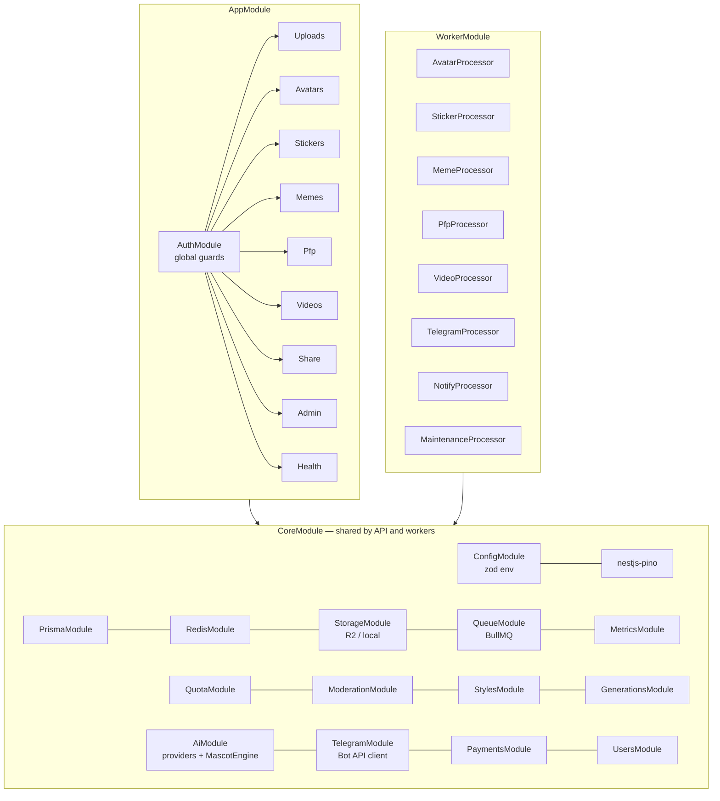

# 4. Backend architecture

NestJS 11 monolith with clean module boundaries, deployed as **two process types from one image**:

- `node dist/main.js` — stateless HTTP API (REST, bot webhook, admin API)
- `node dist/worker.js` — BullMQ workers; `WORKER_QUEUES=avatar,sticker,…` selects which processors run, so pools can be split (e.g. a dedicated video pool) without code changes



## Request lifecycle

1. **pino-http** assigns/propagates `x-request-id`, logs JSON with redacted auth headers.
2. **helmet**, CORS allow-list (Mini App + admin origins), body limits (JSON 256 KB; multipart 15 MB × 20 files on `/upload`).
3. **AuthGuard** (global): verifies the Bearer JWT, enforces audience (`app` tokens cannot call `/admin`, admin tokens cannot call app routes), checks the Redis ban set, records activity (DAU HyperLogLog + throttled `last_seen_at`). `@Public()` opts out.
4. **RateLimitGuard** (global): Redis fixed-window counters declared per route with `@RateLimit({ key, limit, windowSec, by })`; sets `X-RateLimit-*` and `Retry-After`.
5. **ZodPipe** validates bodies against the shared zod schemas.
6. Controller → service. **AllExceptionsFilter** maps everything to the `ApiError` contract.
7. **MetricsInterceptor** records `http_request_duration_seconds{route}` (route template → bounded cardinality).

## Authentication

| Client | Mechanism |
|---|---|
| Mini App | `POST /v1/auth/telegram { initData }` → HMAC-SHA256 with `secret = HMAC("WebAppData", bot_token)` over the sorted data-check-string (all fields except `hash`), 24 h freshness → upsert user, process `start_param` (referral / source / shared mascot) → JWT (24 h, `aud=app`) |
| Admin | Telegram Login Widget → `secret = SHA256(bot_token)` → role must be ADMIN/SUPPORT (or in `TELEGRAM_ADMIN_IDS` bootstrap list) → JWT (12 h, `aud=admin`) + audit log |
| Bot webhook | `X-Telegram-Bot-Api-Secret-Token` constant-time compare |
| Local dev | `POST /v1/auth/dev` only when `DEV_AUTH_ENABLED=true` (rejected by env validation in production) |

## Entitlements & metering (`QuotaService`)

Order of evaluation for every paid action: **plan allowance → credits → HTTP 402** with a machine-readable `paywall.reason`
(`AVATAR_LIMIT`, `STICKER_LIMIT`, `PREMIUM_STYLE`, `PREMIUM_WARDROBE`, `VIDEO_PREMIUM_ONLY`, `VIDEO_QUOTA`, `HD_EXPORT`, `AI_PFP_PREMIUM`, `DAILY_LIMIT`).

| | FREE | PREMIUM |
|---|---|---|
| Mascots | 1 lifetime (counter, so delete-and-recreate doesn't reset it) | unlimited (20/day fair use) |
| Styles | 3 free styles; premium styles via credits | all 11 |
| Stickers | 5 lifetime, then 2 credits each | unlimited (120/day) |
| Memes | 5/day | 200/day |
| Videos | — | 20 units/month, then 25 credits/unit |
| HD export, no watermark, premium wardrobe, AI PFPs, priority queue | — | ✓ |

All definitions live in `packages/shared/src/plans.ts`, so the paywall copy and the enforcement can never disagree.

## Generation launch protocol (`GenerationsService.launch`)

```
idempotency replay? ──yes──► return original response
        │no
authorize() ──402──► client opens paywall
        │ Charge {credits, stickerAllowance, daily, videoUnits}
$transaction(persist domain rows + generation{input.charge}) ──fail──► refund
        │
enqueue(jobId = generation.id, priority = premium ? 1 : 10) ──fail──► mark FAILED + refund, 503
        │
return DTO (client polls GET /v1/generations/:id)
```

## Workers

- **Base class** `GenerationProcessor`: marks PROCESSING (skips canceled/completed jobs on redelivery), runs the pipeline, classifies errors:
  - `PipelineError(retryable=false)` (no face, policy, inconsistent photos) → `UnrecoverableError`, no retry, user-facing message.
  - Provider/network errors → BullMQ exponential backoff (3 attempts; video 2).
  - Final attempt → `onFinalFailure` hook (mark avatar/pack/video FAILED, release photos) → `generations.fail()` → automatic refund.
- **Resumability**: sticker packs skip READY stickers on retry; videos persist `provider_job_id` and resume polling instead of paying twice.
- **Provider protection**: `ProviderRateLimiter` (Redis, cluster-wide RPM), BullMQ limiter on Telegram queues (≤ 25 msg/s).
- **Graceful shutdown**: `enableShutdownHooks()`; K8s grace periods (180 s general, 600 s video) let in-flight jobs finish; stalled jobs are re-queued by BullMQ.

### Maintenance (BullMQ job schedulers — exactly one run per tick cluster-wide)

| Task | Schedule | Does |
|---|---|---|
| `expire-subscriptions` | every 10 min | expires lapsed periods (6 h grace for pending renewals), recomputes plans, resyncs Redis ban set |
| `expire-payments` | hourly | PENDING invoices older than 24 h → EXPIRED |
| `recover-stale-generations` | every 15 min | generations stuck > 30 min with no live job → FAILED + refund |
| `rollup-daily-stats` | hourly | upserts `daily_stats` for yesterday and today |
| `purge-photos` | daily 03:30 UTC | deletes source photos past retention |
| `delete-account` / `delete-avatar` | on demand | GDPR erasure / mascot deletion (storage first, then rows) |

## Error contract

```json
{ "statusCode": 402, "error": "PAYMENT_REQUIRED", "code": "PAYWALL",
  "message": "Free stickers used. Unlock unlimited sticker packs with Premium.",
  "paywall": { "reason": "STICKER_LIMIT", "suggestedProductId": "premium_monthly" },
  "requestId": "6f1c…" }
```

## Observability

- **Logs**: structured JSON (pino) with request ids; auth headers redacted.
- **Metrics** (`/metrics`, workers on `:4001/metrics`): HTTP latency, `generation_total{type,status}`, `generation_duration_seconds`, `ai_provider_requests_total{provider,operation,outcome}`, `ai_provider_cost_micro_usd_total`, `queue_jobs{queue,state}`, `payments_total{product,outcome}` + Node runtime metrics.
- **Alerts**: failure rate > 5 %, avatar backlog > 500, API p95 > 1 s, provider spend spike, invoices without payments (webhook down) — see `infra/k8s/service-monitors.yaml`.
- **Health**: `/health` (liveness), `/health/ready` (Postgres + Redis).

## Configuration

Every variable is declared and validated in `apps/api/src/config/env.ts` (documented in `.env.example`).
Production boot fails fast on: dev JWT secret, dev auth enabled, local storage, missing CDN URL, dev bot token/webhook secret, missing provider keys for the selected providers.
