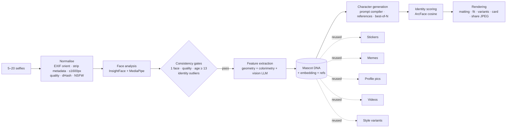

# 7. AI pipeline

Goal: a **stylised** character (Pixar / Fortnite / Arcane / cartoon … visual language) that is **instantly recognisable**
— same face shape, hairline and hairstyle, skin tone, eye shape and colour, brows, nose, lips and proportions — and that
stays the *same character* across every sticker, meme, profile picture and video.

The trick is to separate **identity** (extracted once, stored as Mascot DNA + an ArcFace embedding + reference keys)
from **rendering** (any style, scene, emotion, outfit, pose).



## Stage 1 — Uploading (`POST /upload`, synchronous)

| Step | Implementation |
|---|---|
| Normalise | Sharp: auto-orient by EXIF, **strip all metadata (GPS)**, flatten alpha, cap 1600 px, mozjpeg q90 |
| Quality | mean luminance + variance of the Laplacian (blur) → `quality_score`; too dark / too blurry rejected with a friendly reason |
| Dedupe | `sha256` unique per user + 64-bit perceptual dHash (near-duplicate / reuse detection) |
| Safety | OpenAI `omni-moderation` on the image; sexual/minors → CRITICAL abuse event + auto-ban |
| Instant face check | face-service analysis → face count, pose (FRONT/LEFT/RIGHT/SMILE/NEUTRAL), face size, age gate. The client shows ✓ + detected pose per photo and lights up the 5-pose guide |

## Stage 2 — Face analysis (`apps/face-service`)

Per image (`POST /v1/analyze`):

- **InsightFace `buffalo_l`**: SCRFD detection (+ padded retry for tightly cropped selfies), 3D-landmark head pose (pitch/yaw/roll — robust to smiles and roll), age & sex estimate, **512-d ArcFace embedding** (L2-normalised).
- **MediaPipe Face Mesh** (478 landmarks, refined iris) on an expanded face crop → de-rolled **proportions**: width/height, jaw/cheek, forehead/cheek, inter-pupil distance, eye openness, canthal tilt, nose width vs intercanthal distance, nose length, mouth width, lip fullness; **smile score**.
- **Colorimetry**: cheek + forehead patches in CIE Lab after mild scene-level gray-world correction, specular/shadow pixels discarded → nearest **Monk Skin Tone** (MST 1–10, ΔE with lightness weighted).

Pipeline gates (avatar worker):

1. Keep photos with exactly one significant face, usable quality and an embedding; require ≥ 3.
2. Median age < 13 → `AGE_RESTRICTED` (+ HIGH abuse event).
3. **Identity consistency**: leave-one-out cosine of each embedding vs the mean of the others; outliers (< 0.32) are rejected; > 34 % outliers → `PHOTOS_INCONSISTENT` (+ MULTIPLE_IDENTITIES event). This blocks building mascots of other people from mixed or scraped photos.

## Stage 3 — Feature extraction → Mascot DNA

`buildDna()` (pure, unit-tested) merges three sources, highest weighted confidence wins per trait:

| Source | Traits |
|---|---|
| Geometry (median over frontal photos) | face shape (scored classifier over the 7 shapes), eye shape (openness + canthal tilt), nose (width/length), lips (fullness/width) |
| Colorimetry | skin tone (MST) |
| InsightFace | age → age group, sex votes → default presentation |
| **Vision LLM** (OpenAI, strict JSON-schema structured output over the closed vocabulary) | hair style & colour, eye colour, eyebrows, facial hair, glasses, presentation, freckles, dimples, ≤ 3 distinguishing features, second opinions on geometric traits with confidences |

Persisted in `avatar_dna`: the DNA (validated by `MascotDnaSchema`), per-trait confidence, mean embedding, the
compiled identity description (`describeDna()` — deterministic, cached), the top-4 reference photo keys (frontal & sharp first)
and `extractor_version` for re-extraction campaigns.

```json
{
  "faceShape": "heart", "eyeShape": "round", "eyeColor": "green", "hairStyle": "long-wavy", "hairColor": "auburn",
  "noseShape": "button", "mouthShape": "full", "skinTone": "mst-2", "eyebrows": "thin-arched", "ageGroup": "young-adult",
  "facialHair": "none", "glasses": "none", "presentation": "feminine", "freckles": true, "dimples": false,
  "distinguishingFeatures": ["small mole above left lip"],
  "proportions": { "widthToHeight": 0.78, "jawToCheek": 0.74, "eyeSpacing": 0.46, "canthalTiltDeg": 3.1, "…": "…" }
}
```

## Stage 4 — Character generation

### Style engine

11 declarative recipes in `packages/shared/src/styles.ts` (Pixar, Cartoon, Anime, Cyberpunk, Brick figure, Vinyl pop,
Battle royale, Painterly noir, Loading screen, Fairytale 3D, Comedy 3D). Each recipe = `look`, `characterDesign`
(how far to stylise while preserving identity), `lighting`, `background`, `negative`, `identityStrength`, UI gradient.
Admins can hot-patch any field via `styles.prompt_overrides` (applied within 60 s, no deploy). Prompts describe the visual
language rather than leaning only on studio names — more consistent across providers and safer with brand filters.

### Prompt compiler

Sectioned, deterministic prompts (`apps/api/src/ai/prompts/prompt-compiler.ts`, versioned `PROMPT_VERSION`, stored on every generation):

```
Create a stylised character portrait (a personal mascot) of the person in the reference photos.
IDENTITY — … must be instantly recognisable … Traits to preserve: <describeDna()> … Keep their glasses exactly as described.
STYLE — <look>. Character design: <characterDesign>. Lighting: <lighting>.
SCENE — <pose>, <outfit>. Centered … isolated on a fully transparent background.
CONSTRAINTS — single character only, no text, no watermark, no logos … Avoid: <negative>.
```

Looks picked in the customizer are part of the DNA: `hairKey` (one of 252 catalog hairstyles) and `glassesKey` (one of
104 eyewear pairs or `none`) override the extracted `hairStyle` / `glasses`. `describeDna()` then reads e.g. *"red hair,
box braids hairstyle, wearing pilot sunglasses (gold / green)"*, so every later avatar, sticker, meme and video keeps
the chosen hair and glasses; the 3D mock renderer resolves the same keys.

Variants: style re-render (anchored on the master render + photos), sticker (emotion expression + pose + accent),
meme reaction (emotion + situation), PFP scene, video motion prompt (+ negative prompt for identity drift).

### Providers (`ImageProvider`)

| Provider | Identity mechanism | Output |
|---|---|---|
| **OpenAI Images** `gpt-image-1` (default) | `/images/edits` with up to 16 reference images, `input_fidelity=high` | native transparent PNG |
| **FLUX Kontext Pro** (BFL) | single reference image, async task polling | opaque → matted |
| **Mock** | the in-app three.js character rendered in headless Chromium (`MOCK_IMAGE_RENDERER=3d`, auto-detects Chromium or `CHROMIUM_PATH`); falls back to procedural DNA-driven SVG | transparent PNG (opaque requests get a black/red studio backdrop) |

References: avatar = top-3 photos; everything downstream = **master render first** (style/character anchor) + 1–2 photos (likeness).

### Best-of-N with identity scoring

Premium mascots generate `AVATAR_CANDIDATES` (default 2) candidates; each is run through the face service and scored by
**ArcFace cosine vs the DNA embedding**; the most "you" candidate wins (`identity_score` stored for QA). Stylised faces that
cannot be detected fall back to the first candidate. FREE mascots use one candidate (cost lever).

## Stage 5 — Rendering

1. **Transparency guarantee**: native alpha → else `rembg` (face-service, `isnet-general-use`) → else border flood-fill matting that preserves interior whites (eyes, teeth).
2. `fitMaster`: trim, centre on a 1024² transparent canvas.
3. Variants: **master PNG** (private, HD export), **display WebP 1024** (public, watermarked on FREE), **thumb WebP 320**, **share JPEG 1080²** on the style gradient (Telegram inline results/stories require JPEG photos).
4. **Character card** 1080×1440 PNG: render + name + style badge + 8 DNA trait chips.

## Downstream generators

| Generator | Pipeline |
|---|---|
| **Stickers** | per emotion (62 in the catalog — happy, laughing, crying, angry, shocked, love, sigma, cool, thinking, facepalm, wink, kiss, shy, scared, sleepy, mind-blown, money, party…; the default pack is the first 10, users pick any set) → transparent render (medium quality) → `stickerize`: trim, 512² canvas, **die-cut white outline** from dilated alpha, WebP < 512 KB → Telegram `uploadStickerFile` + `createNewStickerSet` (emoji list + keywords per emotion). Parallelism 3, resumable, partial refunds |
| **Memes** | emotion from explicit choice or EN/RU keyword classifier → **reuses the sticker render of that emotion if one exists (zero AI cost)** else generates a reaction → Sharp/SVG composition in 6 original formats (no copyrighted templates), auto-fit text, watermark on FREE |
| **Profile pictures** | *instant*: master over Sharp-rendered gradient/pattern backgrounds (halftone, rays, synth grid) at 2048² · *AI*: new pose/outfit render or full AI scene, face kept in the circle-safe centre |
| **Videos** | 9:16 / 1:1 / 16:9 start frame (master on template background) → **Kling** (`image2video`, JWT auth) / **Runway** (`gen4_turbo`) / **Veo** (Gemini long-running op) → poll with backoff (job id persisted for resume) → ffmpeg normalise (H.264, faststart) → optional **TTS voice-over** (OpenAI `gpt-4o-mini-tts`, character voice) muxed with looping video → thumbnail |

## Cost & latency (defaults)

| Operation | Provider calls | Cost | p50 latency |
|---|---|---|---|
| Mascot FREE / Premium | vision + 1 / 2 × gpt-image-1 high | $0.17 / $0.34 | 35–60 s |
| Style variant | 1–2 × high | $0.17–0.34 | 25–45 s |
| Sticker | 1 × medium | $0.042 | 15–30 s (pack of 10 ≈ 60–90 s, parallel 3) |
| Meme | 0–2 × medium | $0–0.08 | 1–25 s |
| PFP instant / AI | 0 / 1 × medium | $0 / $0.042 | < 1 s / 20 s |
| Video 5 s | Kling std (+ TTS) | ≈ $0.28 | 1.5–4 min |

All costs are recorded per generation (`cost_micros`) and exported as `ai_provider_cost_micro_usd_total` (alerting on spikes).

## Safety

- Upload moderation (NSFW, minors), age gate on analysis, identity-consistency check, text moderation on meme/video prompts (links, phone numbers, ML policy), provider-side policy rejections mapped to non-retryable `*_POLICY` errors with refunds.
- Consent before biometric processing; embeddings never leave the backend; face service is cluster-internal (NetworkPolicy).
- Generated content is stylised (not photoreal), watermarked on the free tier, and never trained on.

## Quality loop

**Likeness evaluation harness** — `pnpm --filter @mascot/api eval:likeness --dir ./golden --styles all`
(`apps/api/scripts/eval-likeness.ts`). Runs the production pipeline (face analysis → DNA → prompt compiler →
provider → best-of-N) over a golden set of consenting testers (`<dir>/<tester>/consent.json` + 5–15 selfies), with
no database or queues, and reports per style:

| Metric | Meaning |
|---|---|
| identity | ArcFace cosine between the mascot's face and the tester's DNA embedding |
| detection | share of mascots whose stylised face is still detectable |
| rank-1 | the mascot is closer to its own tester than to every other tester (closed-set identification) |
| margin | own similarity − best impostor similarity |
| self-sim | leave-one-out similarity between a tester's own photos (the realistic ceiling) |

Outputs `results.json` (next run's `--baseline`), `results.csv` (with a `human_rating_1_5` column for the 200-person
panel), `report.md` and an `index.html` contact sheet. Gates — `--min-mean`, `--min-rank1`, `--min-detect`,
`--baseline … --max-regression 0.02` — exit non-zero, so a prompt (`PROMPT_VERSION`), provider or model change is
blocked when likeness regresses. `--synthetic N` runs the harness on procedural selfies with the mock analyzer
(pipeline smoke test; scores are synthetic and flagged as such).


- `identity_score`, prompts (`PROMPT_VERSION`), provider and model are stored per render → offline evaluation of likeness by style/provider.
- `extractor_version` on DNA enables re-extraction campaigns when the extractor improves.
- Admin style overrides allow A/B-style prompt fixes without deploys; failures are aggregated by `error_code` in the admin dashboard.
