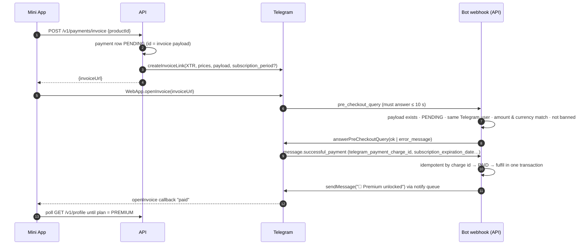

# 9. Payments — Telegram Stars

Digital goods inside Telegram Mini Apps are sold for **Telegram Stars (XTR)**. No payment provider token, no card data
ever touches our servers. Implementation: `apps/api/src/modules/payments/payments.service.ts`.

## Catalog (`packages/shared/src/plans.ts`)

| Product | Kind | Price | Grants |
|---|---|---|---|
| `premium_monthly` | **Star subscription** (`subscription_period = 2592000`, i.e. 30 days — fixed by Telegram) | 450 ⭐ | Premium, auto-renews |
| `premium_yearly` | one-time pass | 3,600 ⭐ | 365 days of Premium (stacks after any active period) |
| `credits_60` / `credits_200` / `credits_600` | one-time | 150 / 450 / 1,125 ⭐ | 60 / 200 / 600 credits |

Credits pay for usage beyond plan allowances: sticker 2 · premium style render 6 · AI profile picture 5 · video unit 25 · extra mascot (FREE) 20.

## Purchase flow

## Fulfilment rules

- **Idempotency**: `payments.telegram_payment_charge_id` is UNIQUE; a duplicate `successful_payment` (Telegram retries, duplicate deliveries) is a no-op. Webhook updates are also de-duplicated by `update_id`, and payment updates are re-delivered by Telegram if our handler fails (non-2xx).
- **Subscriptions**: first payment creates `subscriptions` (`is_recurring=true`, `telegram_charge_id` = first charge — needed to cancel), period end = `subscription_expiration_date`.
- **Renewals**: Telegram sends a new `successful_payment` with the **same payload**, `is_recurring=true`, `is_first_recurring=false` → a new `payments` row linked to the subscription, period extended.
- **Passes** stack: new end = max(now, current premium end) + 365 d.
- **Credits**: ledger entry `PURCHASE` with running balance.
- `users.plan` / `premium_until` are always **recomputed** from live subscriptions (never incremented blindly).

## Cancellation & expiry

- `POST /v1/payments/subscription/cancel` → `editUserStarSubscription(user_id, charge_id, is_canceled=true)`; Premium stays until period end (`status=CANCELED`, `cancel_at_period_end=true`). `…/resume` re-enables.
- `expire-subscriptions` job (every 10 min): passes and canceled subscriptions expire at period end; recurring ones get a **6 h grace** for the renewal webhook before downgrading.
- Pending invoices expire after 24 h.

## Refunds

- Admin panel → `POST /v1/admin/payments/:id/refund` → `refundStarPayment(user_id, telegram_payment_charge_id)` → revoke: credits clawed back (never below zero, ledger `REFUND`), or subscription expired + plan recomputed; audit-logged.
- `message.refunded_payment` from Telegram (e.g. refunds via Telegram support) runs the same revocation idempotently.
- ≥ 3 refunds in 90 days → `PAYMENT_ABUSE` moderation event.
- Failed generations are refunded **automatically in credits/quota**, not Stars — no support ticket needed.

## Compliance

- `/paysupport` command implemented (required for Stars sellers); terms page states refund policy.
- Prices are shown in Stars inside the Mini App; Telegram handles taxes, app-store fees and currency.
- Payouts: Stars are withdrawn via Fragment (TON) or used for Telegram Ads; finance reconciles `payments` (PAID − REFUNDED) against Telegram's Star transactions (`getStarTransactions`) monthly.
- Payment rows survive account erasure with `user_id = NULL` (accounting retention).

## Observability

`payments_total{product, outcome=invoice|paid|renewal|refunded|precheckout_rejected}`; alert when invoices are created but no
payments succeed for 3 h (webhook outage). Revenue analytics (daily Stars, by product, MRR, refunds) in the admin dashboard.

## Testing

The e2e test creates a real invoice (mock Bot API), sends `pre_checkout_query` and `successful_payment` webhook payloads
(including a duplicate delivery), asserts the Premium upgrade and idempotency, then cancels the subscription. For a full
manual test use Telegram's test environment (`TELEGRAM_TEST_ENV=true`) with test Stars.
