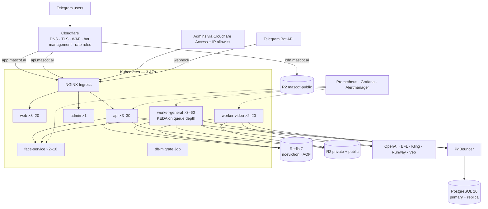

# 10. Production deployment

## Topology

## Environments

| Env | Purpose | Notes |
|---|---|---|
| local | dev | `docker compose up -d postgres redis minio minio-init` + `pnpm dev`; mock AI; dev auth |
| CI | every PR | Postgres/Redis services, typecheck, unit tests, builds, e2e with mock AI + mock Bot API |
| staging | pre-prod | separate bot (or Telegram test env), real providers at low quality, prod-like infra at 1/10 scale |
| production | users | everything below |

## Managed services

| Need | Recommended | Settings |
|---|---|---|
| Kubernetes | EKS / GKE / DOKS, 3 AZs | node pools: `general` (4 vCPU/16 GB), `ml` (8 vCPU or 1× L4 GPU for face-service), spot for worker-video |
| PostgreSQL | RDS / Cloud SQL / Neon (PG 16) | 4 vCPU/16 GB, Multi-AZ, PITR 14 d, 1 read replica (admin analytics), PgBouncer transaction pooling |
| Redis | ElastiCache / Memorystore / Redis Cloud | **`maxmemory-policy noeviction`** (BullMQ requirement), AOF, TLS (`rediss://`), Multi-AZ |
| Object storage | **Cloudflare R2** | `mascot-private` (no public access, signed URLs only), `mascot-public` bound to `cdn.mascot.ai`; CORS + lifecycle in `infra/cloudflare/` |
| CDN / edge | Cloudflare | cache rules: `cdn.mascot.ai/*` cache everything (keys are immutable), `app.mascot.ai/_next/static/*` long TTL |
| Secrets | AWS/GCP Secret Manager → External Secrets Operator | `mascot-secrets` (see `infra/k8s/secrets.example.yaml`) |
| Observability | Prometheus Operator + Grafana + Alertmanager, Loki for logs, Sentry optional | ServiceMonitors/PodMonitor/PrometheusRule in `infra/k8s/service-monitors.yaml` |

## Kubernetes (`infra/k8s`, Kustomize)

- **api**: 3–30 replicas (HPA CPU 65 %), PDB minAvailable 2, readiness `/health/ready`, zone spread, read-only root FS, non-root, `preStop` drain.
- **worker-general** (`WORKER_QUEUES=avatar,sticker,meme,pfp,telegram,notify,maintenance`): 3–60 replicas via **KEDA** on `queue_jobs{state=waiting|prioritized}` (≈ 8 queued jobs per replica), 180 s grace.
- **worker-video** (`WORKER_QUEUES=video`, concurrency 12, I/O-bound polling): 2–20 replicas, 600 s grace, spot-friendly (jobs resume by provider job id).
- **face-service**: 2–16 replicas (HPA CPU 60 %), model weights baked into the image, startup probe for model load; NetworkPolicy allows only api/workers.
- **web**: 3–20 replicas; **admin**: 1 replica behind IP allowlist + Cloudflare Access.
- **db-migrate** Job (`prisma migrate deploy`) runs before every rollout and gates it.
- Default-deny NetworkPolicies; Pod Security `restricted`.

## CI/CD (`.github/workflows`)

1. **ci.yml** (PRs + main): install → shared build → migrations on a service Postgres → typecheck all packages → Jest → build all apps → start API + worker → **e2e smoke** (mock AI + mock Telegram) → face-service pytest.
2. On `main`: build & push 4 images to GHCR (`mascot-api`, `mascot-web`, `mascot-admin`, `mascot-face`) tagged with the commit SHA, with BuildKit GHA cache.
3. **deploy.yml** (release / manual): pin image tags with `kustomize edit set image` → run `db-migrate` Job and wait → `kubectl apply -k` → wait for every rollout → `pnpm telegram:setup` (idempotent webhook/commands).
4. Rollback: re-run deploy with the previous SHA (migrations are expand-only, so the previous release stays compatible).

## Configuration checklist (production)

- [ ] `NODE_ENV=production` (boot fails on dev JWT secret, dev auth, local storage, dev bot token/webhook secret, missing CDN URL)
- [ ] `JWT_SECRET` ≥ 64 random chars; `TELEGRAM_WEBHOOK_SECRET` random; `METRICS_TOKEN` set
- [ ] `TRUST_PROXY_HOPS=2` (Cloudflare + ingress) so rate limits see the real client IP
- [ ] Provider keys + `IMAGE_PROVIDER_RPM` / `VIDEO_PROVIDER_RPM` matched to the vendor tier
- [ ] `MODERATION_PROVIDER=openai`, `FACE_ANALYSIS_PROVIDER=service`, `BACKGROUND_REMOVAL=face-service`
- [ ] `TELEGRAM_ADMIN_IDS` (bootstrap admins), `/setdomain` for the Login Widget
- [ ] R2 CORS + lifecycle applied; public bucket only via custom domain

## Scaling playbook

| Signal | Action |
|---|---|
| Avatar queue backlog > 500 (alert) | KEDA scales workers; if capped, raise `maxReplicaCount` or the provider RPM tier; Premium priority keeps paying users fast |
| Provider 429/5xx spike | limiter queues work; switch `AI_IMAGE_PROVIDER` (openai ↔ flux) via ConfigMap + rollout restart of workers |
| Postgres CPU > 70 % | move admin analytics to the replica, raise PgBouncer pool, partition `generations` |
| Redis memory > 70 % | lower `removeOnComplete` retention, split cache vs queue instances |
| Viral spike (10×) | pre-scale workers (`kubectl scale`) when a large creator campaign is scheduled; Cloudflare absorbs web/CDN load |

## Runbooks

- **Telegram webhook down** (alert: invoices but no payments): check ingress/API logs for `/v1/telegram/webhook`, `getWebhookInfo` (pending updates, last error), re-run `pnpm telegram:setup`. Telegram retries updates for 24 h; idempotency makes replays safe.
- **Provider outage**: generations retry with backoff, then fail with automatic refunds; flip provider; communicate via bot broadcast if prolonged.
- **Stuck generations**: `recover-stale-generations` fails & refunds after 30 min; inspect the queue in the admin Overview (retry failed).
- **Abuse wave**: tighten Cloudflare rate rules on `/v1/upload` and `/v1/auth/telegram`, lower `AUTO_BAN_RISK_SCORE`, review the Abuse page.

## Backups & DR

| Asset | Protection | RPO / RTO |
|---|---|---|
| PostgreSQL | PITR 14 d + daily snapshots to another region | 5 min / 1 h |
| Redis | AOF + replica; queue loss tolerated (stale-job recovery refunds) | 1 s / 15 min |
| R2 | 11 nines durability; public assets re-derivable from masters | — |
| Config | Git (Kustomize) + secret manager | — |

## Security checklist

Telegram initData verification · JWT audience separation · admin behind Cloudflare Access + IP allowlist + role checks + audit log ·
Redis rate limits + daily caps · upload moderation, age gate, identity consistency · private bucket + 15-min signed URLs · EXIF/GPS stripped ·
photos auto-deleted after 30 d · GDPR erasure · NetworkPolicies (face data stays internal) · non-root, read-only containers ·
secrets in secret manager · dependency + image scanning in CI (Dependabot/Trivy recommended) · webhook secret token.
